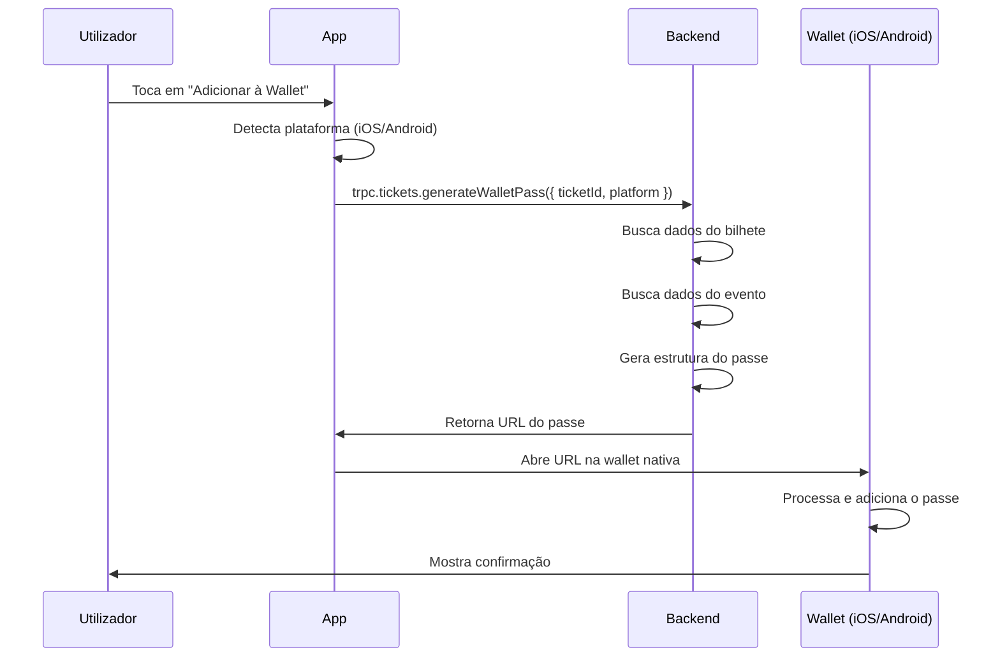

# Integração com Apple Wallet e Google Wallet

## Visão Geral

A plataforma Lyven agora suporta adicionar bilhetes de eventos diretamente à Apple Wallet (iOS) e Google Wallet (Android). Esta funcionalidade permite aos utilizadores ter acesso rápido aos seus bilhetes através das suas carteiras digitais nativas.

## Características Implementadas

### 1. Backend API

**Endpoint:** `tickets.generateWalletPass`

**Tipo:** Mutation

**Input:**
```typescript
{
  ticketId: string;      // ID do bilhete
  platform: 'ios' | 'android';  // Plataforma do dispositivo
}
```

**Output:**
```typescript
{
  success: boolean;
  platform: 'ios' | 'android';
  url: string;          // URL para adicionar o passe à wallet
}
```

### 2. Formato dos Passes

#### Apple Wallet (iOS)
- Formato: PKPass (JSON baseado)
- Tipo: Event Ticket
- Campos incluídos:
  - **Header**: Nome do evento
  - **Primary**: Nome do titular
  - **Secondary**: Local e quantidade de bilhetes
  - **Auxiliary**: Data e hora do evento
  - **Back**: ID do bilhete, endereço completo, preço
  - **Barcode**: QR Code do bilhete

**Estrutura do Pass:**
```json
{
  "formatVersion": 1,
  "passTypeIdentifier": "pass.com.lyven.ticket",
  "serialNumber": "ticket-id",
  "teamIdentifier": "LYVEN",
  "organizationName": "Lyven",
  "description": "Bilhete para [Nome do Evento]",
  "logoText": "Lyven",
  "foregroundColor": "rgb(255, 255, 255)",
  "backgroundColor": "rgb(31, 17, 71)",
  "barcode": {
    "message": "qr-code-data",
    "format": "PKBarcodeFormatQR",
    "messageEncoding": "iso-8859-1"
  },
  "eventTicket": {
    "headerFields": [...],
    "primaryFields": [...],
    "secondaryFields": [...],
    "auxiliaryFields": [...],
    "backFields": [...]
  }
}
```

#### Google Wallet (Android)
- Formato: Google Pay Pass Object
- Tipo: Event Ticket
- Campos incluídos:
  - **Card Title**: Lyven
  - **Header**: Nome do evento
  - **Subheader**: Nome do local
  - **Body**: Nome do titular
  - **Text Modules**: Quantidade, data, hora, endereço, preço
  - **Barcode**: QR Code do bilhete

**Estrutura do Pass:**
```json
{
  "id": "ticket-id",
  "classId": "lyven_event_ticket",
  "state": "ACTIVE",
  "barcode": {
    "type": "QR_CODE",
    "value": "qr-code-data"
  },
  "cardTitle": {
    "defaultValue": {
      "language": "pt",
      "value": "Lyven"
    }
  },
  "hexBackgroundColor": "#1F1147",
  "textModulesData": [...],
  "linksModuleData": {
    "uris": [...]
  }
}
```

### 3. Interface do Utilizador

**Localização:** Tela "Os Meus Bilhetes" (`app/my-tickets.tsx`)

**Funcionalidade:**
- Botão "Adicionar à Apple Wallet" (iOS)
- Botão "Adicionar à Google Wallet" (Android)
- Estados de carregamento durante a geração do passe
- Mensagens de erro caso a operação falhe
- Detecção automática da plataforma

**Design do Botão:**
- Ícone de carteira (Wallet icon)
- Cor de fundo: Primary color da marca (#1F1147)
- Posicionado abaixo do QR Code
- Estado de disabled durante o carregamento

## Fluxo de Utilização

### Para Utilizadores

1. **Aceder aos Bilhetes:**
   - Navegar para "Os Meus Bilhetes"
   - Selecionar a aba "Meus Ingressos"

2. **Adicionar à Wallet:**
   - Tocar no botão "Adicionar à Apple/Google Wallet"
   - Aguardar a geração do passe (indicado por "Adicionando...")
   - A wallet nativa será aberta automaticamente

3. **Confirmar na Wallet:**
   - Revisar os detalhes do bilhete
   - Confirmar adição à wallet
   - O bilhete estará disponível offline

### Processo Técnico



## Dados Incluídos no Passe

Todos os passes incluem:

| Campo | Descrição | Exemplo |
|-------|-----------|---------|
| **Título do Evento** | Nome completo do evento | "Festival de Verão Lisboa 2025" |
| **Nome do Titular** | Nome do comprador do bilhete | "João Silva" |
| **Local** | Nome do venue | "Altice Arena" |
| **Endereço** | Endereço completo do venue | "Rossio dos Olivais, 1990-231 Lisboa" |
| **Data** | Data do evento formatada | "15 de Agosto de 2025" |
| **Hora** | Hora de início do evento | "21:00" |
| **Quantidade** | Número de bilhetes | "2x" |
| **Preço** | Valor pago pelos bilhetes | "€120.00" |
| **ID do Bilhete** | Identificador único | "tkt_abc123xyz" |
| **QR Code** | Código de validação | [Código QR] |

## Validação de Bilhetes

Os passes gerados incluem o mesmo QR Code usado na app, garantindo que:

1. Os promotores podem validar bilhetes da wallet usando o scanner da app
2. Não há diferença entre mostrar o bilhete na app ou na wallet
3. O sistema de validação permanece centralizado e seguro

## URLs de Geração

### Produção
- **Apple Wallet:** `https://wallet.lyven.app/apple?pass={encoded-pass}`
- **Google Wallet:** `https://pay.google.com/gp/v/save/{encoded-pass}`

### Desenvolvimento
- URLs de teste apontam para endpoints de staging

## Segurança

### Medidas Implementadas

1. **Identificadores Únicos:**
   - Cada passe usa o ID único do bilhete
   - Impossível duplicar passes válidos

2. **Validação no Backend:**
   - Verifica se o bilhete existe
   - Verifica se o evento existe
   - Verifica se o utilizador é dono do bilhete

3. **Códigos QR Únicos:**
   - Cada bilhete tem seu próprio QR Code
   - QR Codes são validados no momento da entrada

4. **Sem Dados Sensíveis:**
   - Não incluímos informações de pagamento
   - Não incluímos dados pessoais além do nome

## Limitações Conhecidas

### Apple Wallet
1. **Certificados Necessários:**
   - Requer certificado de desenvolvedor da Apple
   - Passes devem ser assinados digitalmente
   - Implementação atual usa geração simulada

2. **Servidor de Passes:**
   - Apple Wallet requer servidor HTTPS
   - Updates em tempo real precisam de webhook

### Google Wallet
1. **API Key Necessária:**
   - Requer configuração do Google Cloud Console
   - Necessita ativar Google Wallet API

2. **Limitações de Customização:**
   - Templates têm restrições de design
   - Campos limitados comparado ao iOS

## ⚠️ Requisitos para Implementação Completa em Produção

### Certificados e Configurações Obrigatórias

Para que a funcionalidade de Wallet funcione completamente em produção, é **obrigatório** configurar:

#### 1. Apple Wallet - Certificados da Apple

**Requisitos:**
- Conta Apple Developer (99 USD/ano)
- Pass Type ID registrado no portal Apple Developer
- Certificado Pass Type ID (.p12) para assinar os passes
- Team ID da organização

**Passos para Configuração:**

1. **Criar Pass Type ID:**
   - Aceder a [Apple Developer Portal](https://developer.apple.com/account)
   - Navegar para "Certificates, Identifiers & Profiles"
   - Criar novo "Pass Type ID" (ex: `pass.com.lyven.ticket`)

2. **Gerar Certificado:**
   - Criar "Pass Type ID Certificate"
   - Download do certificado (.cer)
   - Converter para formato .p12 (incluindo chave privada)

3. **Configurar no Servidor:**
   ```bash
   # Variáveis de ambiente necessárias
   APPLE_PASS_TYPE_ID=pass.com.lyven.ticket
   APPLE_TEAM_ID=YOUR_TEAM_ID
   APPLE_PASS_CERTIFICATE_PATH=/path/to/certificate.p12
   APPLE_PASS_CERTIFICATE_PASSWORD=certificate_password
   ```

**Sem estes certificados:** Os passes não serão aceites pela Apple Wallet e mostrarão erro ao tentar adicionar.

#### 2. Google Wallet - Configuração Google Cloud Console

**Requisitos:**
- Conta Google Cloud (com faturação ativada)
- Projeto Google Cloud configurado
- Google Wallet API ativada
- Service Account criada
- Issuer ID registado

**Passos para Configuração:**

1. **Criar Projeto Google Cloud:**
   - Aceder a [Google Cloud Console](https://console.cloud.google.com)
   - Criar novo projeto ou usar existente
   - Ativar faturação (necessário para Google Wallet API)

2. **Ativar Google Wallet API:**
   - No projeto, navegar para "APIs & Services"
   - Procurar "Google Wallet API"
   - Clicar em "Enable"

3. **Criar Service Account:**
   - Navegar para "IAM & Admin" > "Service Accounts"
   - Criar nova Service Account
   - Gerar chave JSON
   - Dar permissões necessárias

4. **Registar Issuer:**
   - Aceder a [Google Pay & Wallet Console](https://pay.google.com/business/console)
   - Criar Issuer Account
   - Obter Issuer ID (formato: `3388000000XXXXXXXXX`)

5. **Configurar no Servidor:**
   ```bash
   # Variáveis de ambiente necessárias
   GOOGLE_WALLET_ISSUER_ID=3388000000XXXXXXXXX
   GOOGLE_WALLET_SERVICE_ACCOUNT_EMAIL=service-account@project.iam.gserviceaccount.com
   GOOGLE_WALLET_PRIVATE_KEY_PATH=/path/to/service-account-key.json
   ```

**Sem esta configuração:** Os passes não serão gerados corretamente e os utilizadores receberão erro ao tentar adicionar ao Google Wallet.

### Resumo de Custos

| Serviço | Custo | Frequência |
|---------|-------|------------|
| **Apple Developer Program** | 99 USD | Anual |
| **Google Cloud** | Variável* | Mensal |

*Google Cloud: Custos baseados em uso da API. Google Wallet API tem tier gratuito inicial, mas pode haver custos de infraestrutura do GCP.

### Checklist de Implementação

Antes de lançar em produção, confirmar:

- [ ] Conta Apple Developer ativa
- [ ] Pass Type ID criado e certificado gerado
- [ ] Certificado .p12 instalado no servidor
- [ ] Projeto Google Cloud criado
- [ ] Faturação ativada no Google Cloud
- [ ] Google Wallet API ativada
- [ ] Service Account criada com chave JSON
- [ ] Issuer ID obtido e configurado
- [ ] Todas as variáveis de ambiente configuradas
- [ ] Testes realizados em dispositivos reais (iOS e Android)
- [ ] Validação de QR codes a funcionar com passes da wallet

### ⚠️ Aviso Importante

**A implementação atual é uma simulação para desenvolvimento.** Para funcionar em produção com utilizadores reais, é **obrigatório** completar todas as configurações acima. Sem os certificados da Apple e a configuração do Google Wallet, a funcionalidade **não funcionará** para utilizadores finais.

## Próximos Passos Recomendados

### Para Produção Completa

1. **Configuração de Certificados:**
   ```bash
   # iOS: Obter certificados da Apple Developer
   # Android: Configurar Google Wallet API
   ```

2. **Servidor de Geração de Passes:**
   - Implementar servidor que assina passes PKPass
   - Configurar endpoints para updates de passes
   - Implementar webhook para notificações

3. **Testes Extensivos:**
   - Testar em dispositivos iOS reais
   - Testar em dispositivos Android reais
   - Validar QR codes da wallet com scanner

4. **Monitoramento:**
   - Rastrear quantos utilizadores adicionam à wallet
   - Monitorar taxa de sucesso/falha
   - Analytics de uso da funcionalidade

## Exemplo de Uso da API

### No Frontend (React Native)

```typescript
import { trpc } from '@/lib/trpc';
import { Platform, Linking } from 'react-native';

const generateWalletPassMutation = trpc.tickets.generateWalletPass.useMutation();

const handleAddToWallet = async (ticketId: string) => {
  const platform = Platform.OS === 'ios' ? 'ios' : 'android';
  
  try {
    const result = await generateWalletPassMutation.mutateAsync({
      ticketId,
      platform,
    });
    
    if (result.success && result.url) {
      await Linking.openURL(result.url);
    }
  } catch (error) {
    console.error('Erro ao adicionar à wallet:', error);
  }
};
```

### Com tRPC Client (Fora de Componentes)

```typescript
import { trpcClient } from '@/lib/trpc';

const result = await trpcClient.tickets.generateWalletPass.mutate({
  ticketId: 'tkt_123',
  platform: 'ios',
});

console.log('Pass URL:', result.url);
```

## Suporte e Troubleshooting

### Erro: "Não foi possível abrir Apple/Google Wallet"

**Causa:** App da wallet não está instalada ou URL inválida

**Solução:**
- iOS: Wallet app vem pré-instalado no iOS
- Android: Instalar Google Wallet da Play Store

### Erro: "Bilhete não encontrado"

**Causa:** ID do bilhete inválido ou bilhete foi deletado

**Solução:**
- Verificar se o ID do bilhete está correto
- Confirmar que o bilhete ainda existe no banco de dados

### Erro: "Evento não encontrado"

**Causa:** Evento associado ao bilhete foi removido

**Solução:**
- Verificar integridade referencial no banco de dados
- Implementar soft delete para eventos

## Recursos Adicionais

- [Apple Wallet Developer Guide](https://developer.apple.com/wallet/)
- [Google Wallet API Documentation](https://developers.google.com/wallet)
- [PassKit Format Reference](https://developer.apple.com/library/archive/documentation/UserExperience/Reference/PassKit_Bundle/Chapters/Introduction.html)

## Changelog

### v1.0.0 (Janeiro 2025)
- ✅ Implementação inicial da API de geração de passes
- ✅ Suporte para Apple Wallet (iOS)
- ✅ Suporte para Google Wallet (Android)
- ✅ Interface de utilizador com botões nativos
- ✅ Detecção automática de plataforma
- ✅ Estados de carregamento e erros
- ✅ Documentação completa

---

**Desenvolvido por:** Equipa Lyven  
**Última atualização:** Janeiro 2025  
**Versão:** 1.0.0
